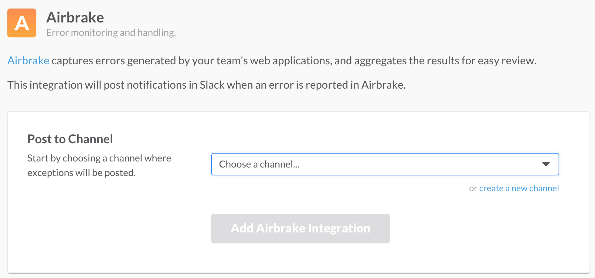
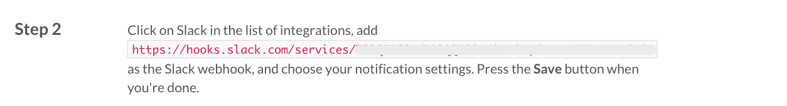
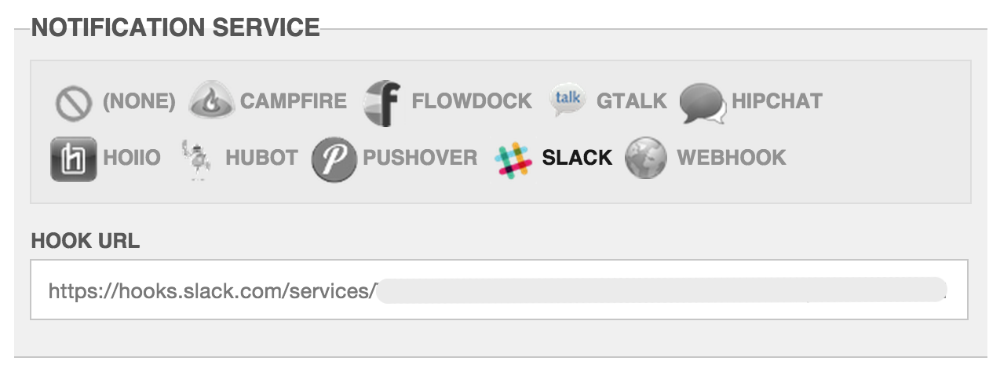

# Slack

The Slack notification sends to [Slack](https://www.slack.com/).

## Configuration

### Add the Airbrake Notification Integration on Slack

### Hook URL

Copy the Hook URL specified by the Slack service.

### Setup in Errbit

On the App Edit Page, click to highlight the slack integration.
Input the hook url from above into the field and click save.

### Setting the Host URL for Slack Links

If the links in your Slack notifications default to `http://errbit.example.com`, you need to set the `ERRBIT_HOST` environment variable on your Errbit server (e.g., in the `.env` file). Note that setting the host in the Airbrake JavaScript client configuration does not affect the URL generated by the Errbit server for Slack notifications.
